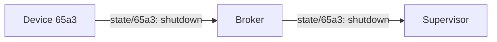
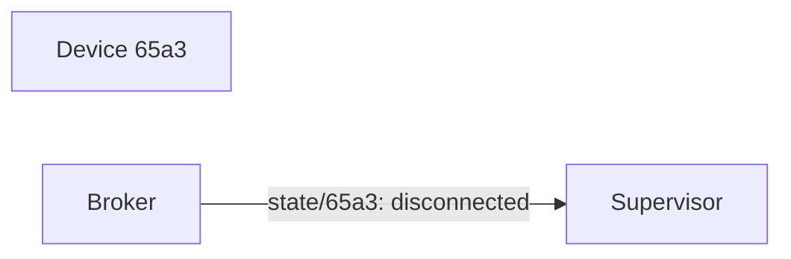

# Connect
Super are informed whenever sites come online or go offline.


## Versioning
Sites and supervisor must use compatible version of MQTT. This is handled by the MQTT protocol and the broker.


## Connect
After connecting, the site publishes to the `state/<id>` topic, with a payload that indicates it's online: 

	```mermaid
 graph LR;
      A[Device 65a3]-->|state/65a3: ok| Broker;
      Broker-->|state/65a3: ok| Supervisor;
```


## Disconnect
A graceful disconnect (e.g. if the device chooses to power down to to a low battery, or a manual shutdown) can be handled by the device posting to the 'state' topic:
`state/<id>`



An unexpected disconnect is handled using Last Will. When connecting to the broker, the site set Last Will and Testament (LWT), which will be published by the broker if the site is disconnected. The topic `state/<id>` is used, with a payload indicating that the site was disconnected unexpectedly:



More about Last Will:
https://www.hivemq.com/blog/mqtt-essentials-part-9-last-will-and-testament/

## Disconnected Supervisor
Retained message should be used when publishing to `state/<id>`. If the supervisor is disconnected from the broker, the broker will retain th last messages send be each device. When the supervisor comes back online, it will immediately get the current state of all sites.
