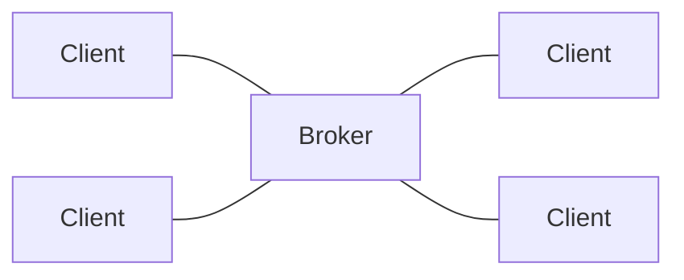
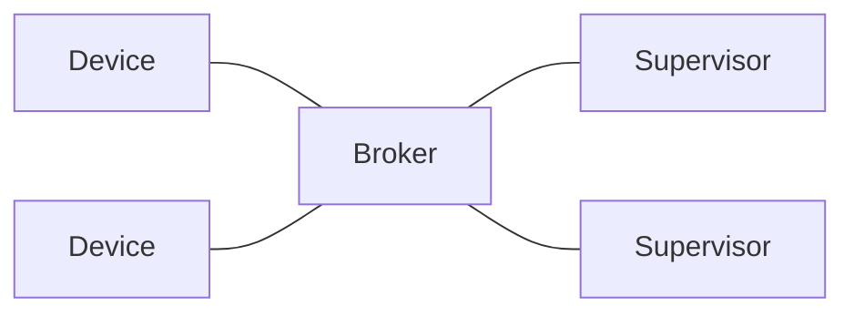

# Background
## Build on MQTT
RSMP 4 is expected to be build on top of [MQTT](https://mqtt.org/), a protocol popular for IoT devices.

MQTT is based on a publish-subscribe model with a broker in the middle and topics as a flexible way to route and filter message.

### Broker
In MQTT, clients all connect to the broker, which routes messages according to which topics are used when subscribing and publishing:

Clients can communicate with all other clients, as long as they agree on which topics to use.

There is no inherent idea of a client vs. supervisor side in MQTT, it's all just clients. But for RSMP we will still use a concept of devices and supervisors:

Note that devices can talk to each other, and supervisors can also talk to each other (depending on how to design topic), via the broker.

### Topics
From https://www.hivemq.com/blog/mqtt-essentials-part-4-mqtt-publish-subscribe-unsubscribe/

MQTT uses the topic name as a fundamental concept. It structures this name hierarchically using forward slashes as delimiters and creates a simple string. It’s similar to a URL path but without the protocol and domain components. MQTT topics are used to label messages and provide a way for clients to subscribe to specific messages.

For example, a device that measures temperature might publish its readings to the topic "sensors/temperature/livingroom". A client interested in these readings can subscribe to this topic and receive updates as they’re published.

MQTT provides two types of wildcards to use with topic subscriptions:

- "+" (plus sign) is used to match a single level in the hierarchy. For example, a subscription to "sensors/+/livingroom" would match “sensors/temperature/livingroom” and “sensors/humidity/livingroom”, but not “sensors/temperature/kitchen”.
- "#" (hash sign) is used to match multiple levels in the hierarchy. For example, a subscription to “sensors/#” would match “sensors/temperature/livingroom”, “sensors/humidity/kitchen”, and “sensors/power/meter1”_

For RSMP 4, a set of fixed topic paths is used for commands, statuses, alarms, etc.
