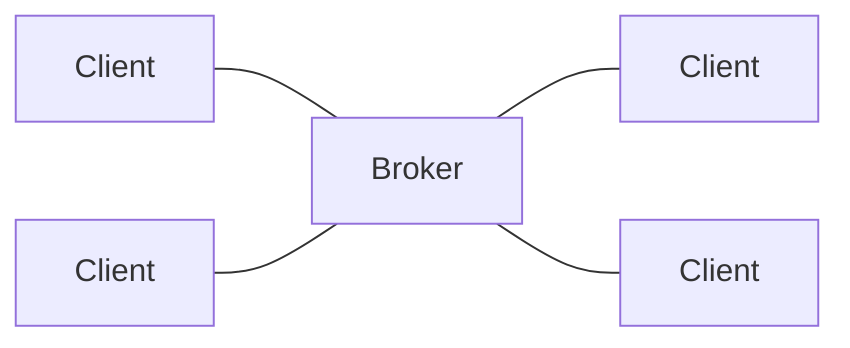

# MQTT
RSMP 4 is build on top of [MQTT](https://mqtt.org/). MQTT is based on a publish-subscribe model with a broker in the middle and topic paths as a flexible way to route and filter message.

## Broker
With MQTT, all clients connect to a central broker, which routes messages basd on topics paths:

The architecture makes it possible for clients to communicate with all other clients, via the broker. However, you can setup access control on the broker when needed.

There is no inherent idea of a site vs. supervisor side in MQTT, it's all just clients connecting to the broker. In RSMP 4 clients are known as _nodes_.

## Topic Paths
MQTT uses topic paths as a fundemental concept. A topic path is string using forward slashes as delimiters, for example:

`status/tlc/1/83fa`

A message is published to a particular toppic path.

Topic paths are used to subscribe to specific messages. You can use two types of wildcards when subscribing:

"+" (plus sign) is used to match a single level in the hierarchy. For example, a client could subscribe to `status/tlc/1/+` to get status messages from any client.

"#" (hash sign) is used to match multiple levels in the hierarchy. For example, a client could subscribe to `status/#` to subscribe to any status messages.

RSMP 4 defines a specific set of topic paths for commands, statuses, alarms, etc.
