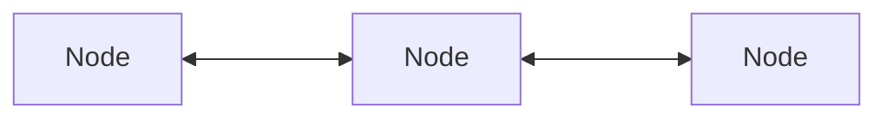

# Nodes
RSMP communication happens between nodes:

A node can connect to one or more other nodes.

## Differences from RSMP 3
In RSMP 3, a supervisor has an initiating role, while a site has a reponding role, but this is limiting because:
- a TLC might needs to send commands to other nodes, so it's initiating.
- a central system might receive commands from another systems, so it's responding.

This is why RSMP 4 instead uses the more general concept of a node.
