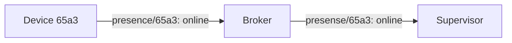
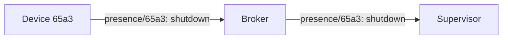
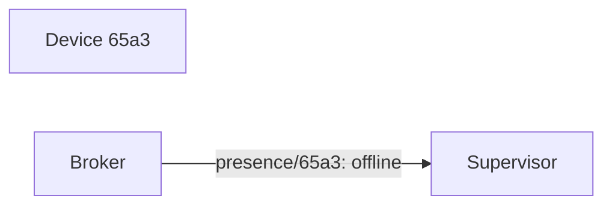

# Presence
Used when nodes come online or go offline.

```
presence/<sender>
````

Examples:
```
presence/45fe
```

## Connect
After connecting, a node publishes to `presence/<id>`, with a payload that indicates it's online: 



## Disconnect
A graceful disconnect (e.g. if the device chooses to power down to to a low battery, or a manual shutdown) can be handled by the device posting to `presence/<id>`, then disconnecting.



An unexpected disconnect is handled using Last Will. When connecting to the broker, the site set Last Will and Testament (LWT), which will be published by the broker on behalf of the site, in case he site is disconnected. The topic `state/<id>` is used, with a payload indicating that the site was disconnected unexpectedly:



More about Last Will:
https://www.hivemq.com/blog/mqtt-essentials-part-9-last-will-and-testament/

## Retained messages
Messages publishing to `presence/<id>` should be retainedd. When a node connects, and wants the status of other nodes, it subscribes `presence/#`. It will then immediately get the latest presence know by the broker, for all nodes.
