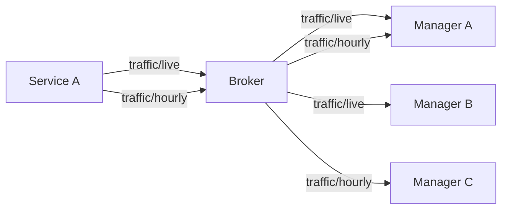
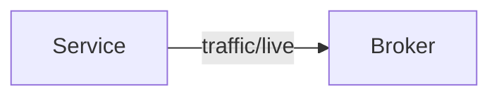
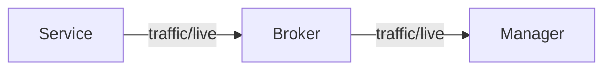

# Streams
Status updates are delivered via _streams_.

A stream defines how status updates are delived, including:

- status module and code, e.g. tlc/2
- attribute set
- update rate
- aggregation, e.g. sum and average
- chunking. ie. gather multiple events in a single message
- defaults state
- timeouts

A node can have ome or more streams configured for each status type. 

Unlike RSMP 3, you don't specify subscription settings when you start fetching data.
Instead you choose between the already defined streams.

If the node allows stream administration, consumers can add/edit streams.

## Receiveing data
To receive data the stream must be started and you must be subscribed to the associated topic path.

Starting and stopping a stream controls whether data is published to the
associated topic path on the broker. If a stream is configured as on by default, you don't need to manually start it.

Subscribing to the associated topic path controls whether you receive
data from the broker.

## Starting and Stopping
When you start a stream, it starts publishing data to broker,
even if nobody has yet subscribed to the relevant topic path:

Consumers must be subscribed to the relevant topic path to receive data from the broker:

When you stop a stream, data is no longer publishhed to the broker.
Consumers will no longer receive data, even if they are still subscribed to the relevant topic path.

## Stream configuration
### Status module and id
Identifies the status with module name, and status code id, e.g. `tlc/2`.

### Attributes
The set of attributes to include in status updates. For each attribute:
- Type: Live (Send on Change), Lazy (send when other attributes change)
- Aggregation: off, count, average, median, max, min. Aggration is done according to the key interval.

### Key Interval
Interval to send full updates, which are retained on the broker.

### Delta Interval
Interval to send delta updates which contain only attributes that changed
and are not retained on the broker.

If set to live, delta updates are send immediately when attributes changes.

If set to a number, it indicating the number of delta updates between key updates.
Update are send according to keyframe and delta intervals, not immediatelely
when attributes change.

### Default State
A stream configured as off by default must be started before it publishes data to the broker.
A stream configured as on by default starts publishing to the broker immediately after the node starts up.

## Listing Streams
The node provides a list of available streams, with information about attribute set,
update rate, aggregation, etc.

## Stream Administration
If a node supports stream administration, remote nodes can:

- add new stream
- edit existing stream
- remove existing stream

Access to stream administration can be managed by access control lists on the broker.

## Pruning
Streams can be configured to automatically stop when consumers disappear, or have
been offline for a predefined period.

This is useful for streams that take up significant bandwidth, and you want to be sure
that they are stopped when not used anymore.

Automatic stopping can be based on timeouts and `presence` message, which informs the node
when other nodes go online/offline.

[To be expanded]

