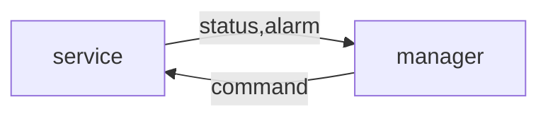

# Modules
A node implement modules to support specific types or hardware or functionality, e.g. traffic light control, sensor data, log files or scenario management.

A modules defines an interface consisting of commands, statuses and alarms. It can also defines behaviour.

A modules works with components of specific types. For example, a traffic light control module might work with signal groups and detector logics.

Different modules can work with the same kind of component. For example, a traffic light control module and a sensor data module might both work with detector logic components.

A module has two ends that interact, the service and the manager. A node typically implements either the service or the manager end of a module, but can implement both.



## Service
The service end of a module maintains internal status and often runs some kind of process.

A service receives commands from managers of the same type and sends statuses and alarms to them. 

## Manager
The manager end of a module is used to manage coresponding services running on remote nodes.

A manager sends commands to a service of the same type, and receives statuses and alarms from the service. 

A manager maintains a local cache of the status of the remote service.

## Remotes
A node keeps a list of remote nodes that it neeeds to manages (send commands to or collect status from).

A remote has a manager for each service at the remote node that it can manage.

Because communication passes through a central MQTT broker, a service does not need to keep a list of managers to send statuses to them. Anyone (permitted by the broker) can subscribe to statuses from a service, or send it commands.

Om the other hand, a node that manages other nodes keeps a list of these remotes to maintain a local cache of their status, and to be able to send commands to invidual remotes.


### Example: Central system C1 manages a Sensor D1
```
node C1
  remote D1
    manager Sensor

node D1
  service Sensor
```

### Example: Central System C1 manages TLCs D1 and D2
```
node C1
  remote D1
    manager TLC
  remote D2
    manager TLC

node D1
  service TLC

node D2
  service TLC
```

### Example: Central system D1 manages TLCs D1 and D2, D1 also manages D2
```
node C1
  remote D1
    manager TLC
  remote D2
    manager TLC

node D1
  service TLC
  remote D2
    manager TLC

node D2
  service TLC
```

### Example: Central system D1 manages scenariso on Central system D2
```
node C1
  remote C2
    manager Scenarios

node C2
  service Scenarios
```

### Compatibility
It's backward compatible:
- A traditional site is a node with services, and no remotes
- A traditional supervisor is a node with remotes, and no service

Site-to-site can be handled by adding remotes and managers to a site.
Center-to-center can be handled by adding services to a supervisor.
