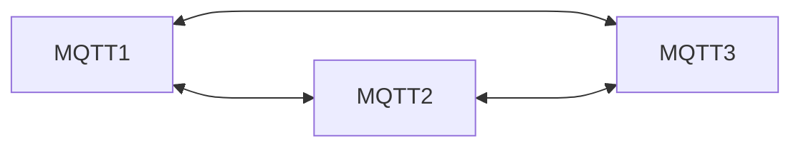
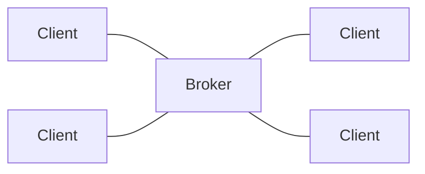
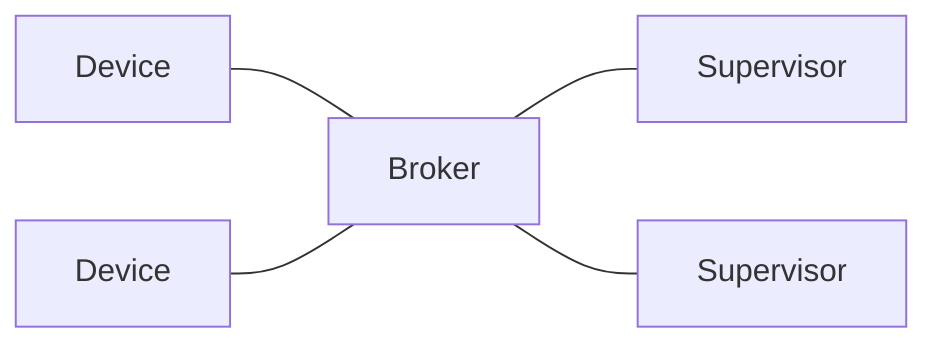

# MQTT
RSMP 4 is expected to be build on top of [MQTT](https://mqtt.org/), a protocol popular for IoT devices.

MQTT is based on a publish-subscribe model with a broker in the middle and topics as a flexible way to route and filter message.

## Why MQTT?

RSMP were designed and developed about 15 years ago. Over the years RSMP has
been regularly updated to include more features since more desired use cases has
been identified.

As the RSMP specification has evolved the limitations of some of its original
designed choices has gotten more apparent. This includes several aspects of the
protocol.

### Performance

By default, RSMP sends all data as human readable JSON. Although it's great for
troubleshooting, it also means that each RSMP packet is quite large and uses a
relativity high amount of network traffic.

Each packet transmitted needs to be acknowledged, not just on the underlying TCP
layer, but also on the RSMP layer using "MessageAck". This leads to a high
amount of network roundtrips increasing network traffic and latency.

RSMP has built in support for buffering to compensate for unreliable networks.
Up to 10000 messages must be buffered in the equipment and sent upon connection
reestablishment. But since RSMP doesn't prioritize any messages and all messages
needs to be sent using the FIFO-principle it means that all buffered messages
needs to delivered before the most recent messages can be transmitted. This
means it may take a long time between connection establishment and receiving the
current state of the equipment - especially if the connection is slow.

### Management

RSMP doesn't have any concept of auto discovery of the connected equipment and
requires a relative large amount of configuration in order to work correctly.

In order to support communicating with multiple supervisors, each controller
needs to independently establish connection to each supervisor, including
keeping track of all associated connection related parameters. The controllers
also need to implement access control to prevent any management system to send
arbitrary commands.

To mitigate performance related issues regarding buffering, the controller needs
to be configured not to buffer unneeded message types. This configuration needs
to be done for each controller.

Updating RSMP to adress these issues is possible, but not backwards compatible.
A better use of our efforts is to rely on existing standards where these issues
already are addressed.

### Design of MQTT

MQTT is well known and established in the industry with many well proven
implementations in use.

MQTT introduces a concept of QoS which ensures a higher level of robustness of
message delivery, partially replacing the need of buffering data which is part
of the current specification.  Any further need to transfer historical data can
be implemented separately where needed.

Instead of using a traditional client-service architecture MQTT uses broker in
the middle. The use of a broker solves several issues that currently exists in
RSMP. It solves performance issues since publishing and subscriptions can be
handled independently of each other. It also handles management issues since the
equipment doesn't need to keep track of communicating with several management
systems. Access control can be managed by the broker.

MQTT also has mature and proven standard software libraries and simulators which
is readily available.

Adopting MQTT in RSMP means that we can focus on the content of the messages
instead of the transport mechanisms.

#### Scalability

By leveraging load balancing, MQTT could distribute the communication load across
multiple brokers, potentially enhancing system performance under heavy traffic.
The ability to broadcast messages to groups of devices using topic hierarchies
might further optimize message delivery. These features could contribute to better
management of system load and improve overall resilience, ensuring uninterrupted
communication even under failure or high-demand scenarios.

## MQTT Broker
In MQTT, clients all connect to the broker, which routes messages according to which topics are used when subscribing and publishing:

Clients can communicate with all other clients, as long as they agree on which topics to use.

There is no inherent idea of a client vs. supervisor side in MQTT, it's all just clients. But for RSMP we will still use a concept of devices and supervisors:

Note that devices can talk to each other, and supervisors can also talk to each other (depending on how to design topic), via the broker.

## MQTT Topics
From https://www.hivemq.com/blog/mqtt-essentials-part-4-mqtt-publish-subscribe-unsubscribe/

MQTT uses the topic name as a fundamental concept. It structures this name hierarchically using forward slashes as delimiters and creates a simple string. It’s similar to a URL path but without the protocol and domain components. MQTT topics are used to label messages and provide a way for clients to subscribe to specific messages.

For example, a device that measures temperature might publish its readings to the topic "sensors/temperature/livingroom". A client interested in these readings can subscribe to this topic and receive updates as they’re published.

MQTT provides two types of wildcards to use with topic subscriptions:

- "+" (plus sign) is used to match a single level in the hierarchy. For example, a subscription to "sensors/+/livingroom" would match “sensors/temperature/livingroom” and “sensors/humidity/livingroom”, but not “sensors/temperature/kitchen”.
- "#" (hash sign) is used to match multiple levels in the hierarchy. For example, a subscription to “sensors/#” would match “sensors/temperature/livingroom”, “sensors/humidity/kitchen”, and “sensors/power/meter1”_

For RSMP 4, a set of fixed topic paths is used for commands, statuses, alarms, etc.
