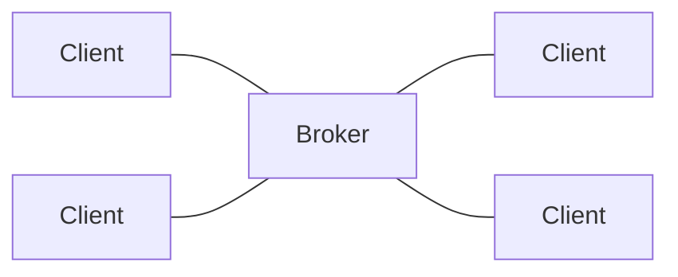
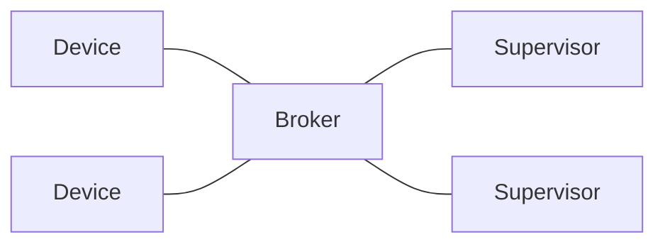
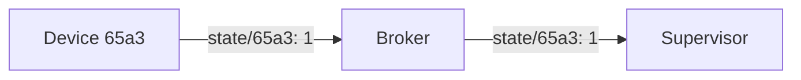
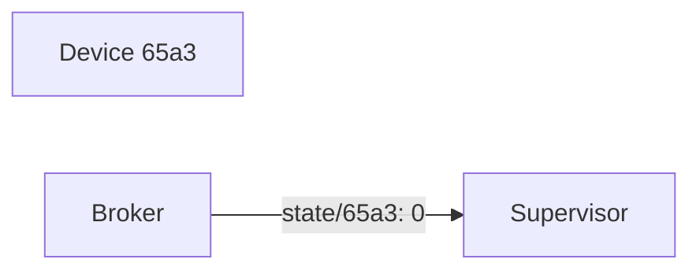

# RSMP on MQTT
MQTT is a popular protocol for IoT devices. It uses a publish-subscribe model with a broker:
https://mqtt.org/

It uses topics as a flexible way to route and filter message, see e.g:
https://www.hivemq.com/blog/mqtt-essentials-part-5-mqtt-topics-best-practices/

Here I want to look at how existing RSMP use cases would be handled with MQTT

## Broker
In MQTT, clients all connect to the broker, which routes messages according to which topics are used when subscribing and publishing:

Clients can communicate with all other clients, as long as they agree on which topics to use.

There is no inherent idea of a client vs. supervisor side in MQTT, it's all just clients. But for RSMP we would still use the concept of devices and supervisors:

Note that site-to-site and supervisor-to-supervisor communication is possible

## Permissions
Permissions should be set up on the broker, e.g. to only allow supervisor to send commands.

## Topics
From https://www.hivemq.com/blog/mqtt-essentials-part-4-mqtt-publish-subscribe-unsubscribe/

MQTT uses the topic name as a fundamental concept. It structures this name hierarchically using forward slashes as delimiters and creates a simple string. It’s similar to a URL path but without the protocol and domain components. MQTT topics are used to label messages and provide a way for clients to subscribe to specific messages.

For example, a device that measures temperature might publish its readings to the topic "sensors/temperature/livingroom". A client interested in these readings can subscribe to this topic and receive updates as they’re published.

MQTT provides two types of wildcards to use with topic subscriptions:

- "+" (plus sign) is used to match a single level in the hierarchy. For example, a subscription to "sensors/+/livingroom" would match “sensors/temperature/livingroom” and “sensors/humidity/livingroom”, but not “sensors/temperature/kitchen”.
- "#" (hash sign) is used to match multiple levels in the hierarchy. For example, a subscription to “sensors/#” would match “sensors/temperature/livingroom”, “sensors/humidity/kitchen”, and “sensors/power/meter1”_

## Discovery and Connection State
In RSMP 3, the device connect to the supervisor. With MQTT the device still connect to a central server, but it's the broker, rather than the supervisor.

When a device with <id> connects, it sends state to `state/<id>` with the payload set to 1:

This means devices will announce themselves to supervisors.

When the device does offline, the last will (set when conencting) is send by the broker to `state/<id>` with payload set to 0:

This also works of the supervisor goes offline. Once it comes back online, it immediately gets the state of all known devices, including any that are currently offline.

